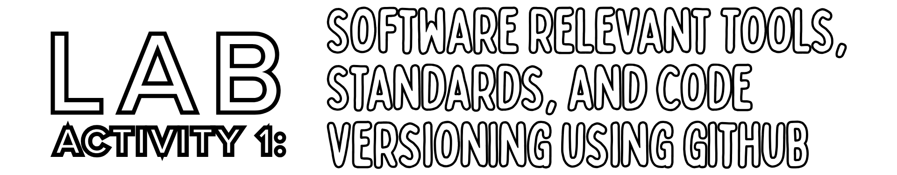
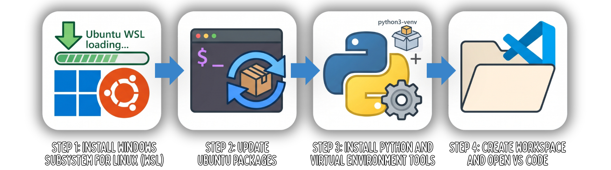
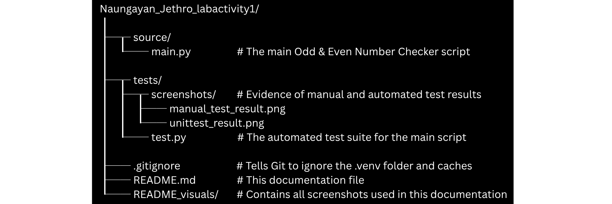
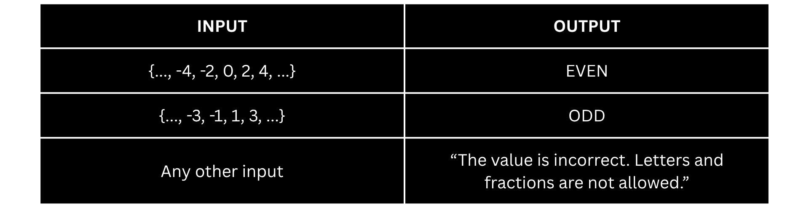
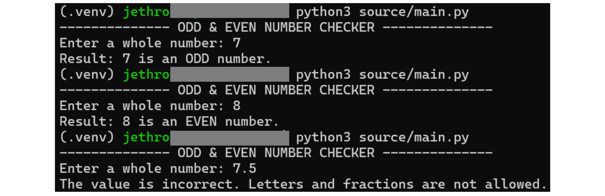
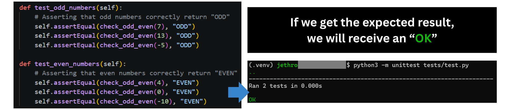

> **Note:** Parts of this documentation were assisted by AI to help ensure correctness.

**Author:** Jethro C. Naungayan

**Course & Block:** CPE106L-4_B1

## Overview

This repository reports the completion of Lab Activity 1. The activity focused on creating a clean Python lab workspace in WSL, initializing a virtual environment, setting up a Git repository, and recording evidence of basic version control operations. To demonstrate the requirements, a command line application that checks whether an input is an odd or an even number was used as the Python program.

This README specifically explains how to run the activity starting from zero.

## Prerequisites

This activity was done on Windows. To do the activity, our system must be configured with the necessary tools. 



Open Windows PowerShell as an Administrator (necessary for step 1) and run the following commands:

**1. Install Windows Subsystem for Linux (WSL)**
```powershell
wsl --install -d Ubuntu
```
**2. Update Ubuntu Packages**
```bash
sudo apt update
```
**3. Install Python and Virtual Environment Tools**
```bash
sudo apt install python3 python3-venv -y
```
**4. Create Workspace and Open VS Code**
```bash
mkdir Naungayan_Jethro_labactivity1   # Creates the main project folder
cd Naungayan_Jethro_labactivity1      # Moves your terminal inside the new folder
code .                                # Opens this specific folder in VS Code
```

## Project Structure

Here is how the files are organized within this repository:



## How to Run the Activity (for Windows Users)

Open Windows PowerShell and run the following commands:

### 1. Enter Linux Environment
```powershell
wsl   # Switches your terminal to your Ubuntu terminal
cd ~  # Brings you to the Linux main user folder
```

### 2. Clone the Repository
```bash
git clone https://github.com/20pesos/Naungayan_Jethro_labactivity1  # Downloads a copy of the repository
cd Naungayan_Jethro_labactivity1                                    # Enters the folder of the copy
```

### 3. Create and Activate a Virtual Environment
Because virtual environments are not tracked by Git, you must create a new one locally and activate it.
```bash
python3 -m venv .venv
source .venv/bin/activate
```
*(You will know it is active when your terminal line starts with `(.venv)`).*

### 4. Run the Main Program
```bash
python3 source/main.py
```
Write an input and click enter.



An example can be seen below:



### 5. Run the Automated Tests

Run the automated tests using unittest.

```bash
python3 -m unittest tests/test.py
```


### 6. Deactivate the Environment
When you are done, exit the virtual environment by typing:
```bash
deactivate
```
